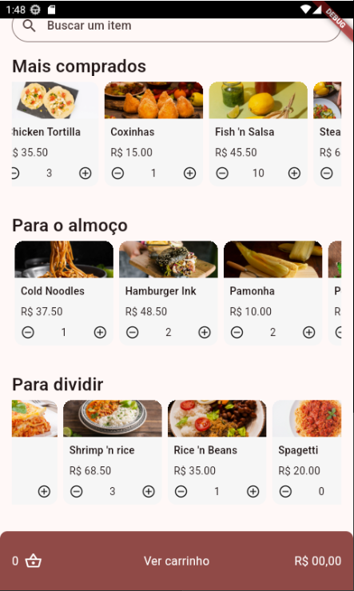

# 🚚 Flutter Panucci Delivery using GetX  

Bem-vindo ao **Panucci Delivery**, um projeto desenvolvido em Flutter que simula um sistema de delivery moderno e funcional. Este projeto foi criado como parte do aprendizado do curso Alura, utilizando o poderoso gerenciamento de estado **GetX**.

## 🖼️ Demonstração  
  

> **Nota:** Para rodar o projeto localmente e visualizar todas as telas, siga as instruções abaixo.

---

## 🚀 Funcionalidades  

- **Gerenciamento de estado com GetX:** Simples e eficiente.  
- **Interface responsiva:** Adaptável a diferentes tamanhos de tela.  
- **Fluxo de navegação fluido:** Experiência do usuário aprimorada.  

---

## 🛠️ Tecnologias Utilizadas  

- **Flutter**: Framework para desenvolvimento mobile.  
- **GetX**: Gerenciamento de estado e rotas.  
- **Dart**: Linguagem de programação.  

---

🏃‍♂️ Como Executar
Clone este repositório:

- ```git clone https://github.com/obrenoluiz/Flutter-Panucci-Delivery-using-GetX-Alura.git```
- ```cd flutter-panucci-delivery```

Instale as dependências:

```flutter pub get```

Execute o aplicativo:

```flutter run```

📝 Licença
Este projeto está sob a licença MIT. Consulte o arquivo LICENSE para mais detalhes.

Desenvolvido com 💙 por Breno Luiz ~ Durante o curso da Alura.
